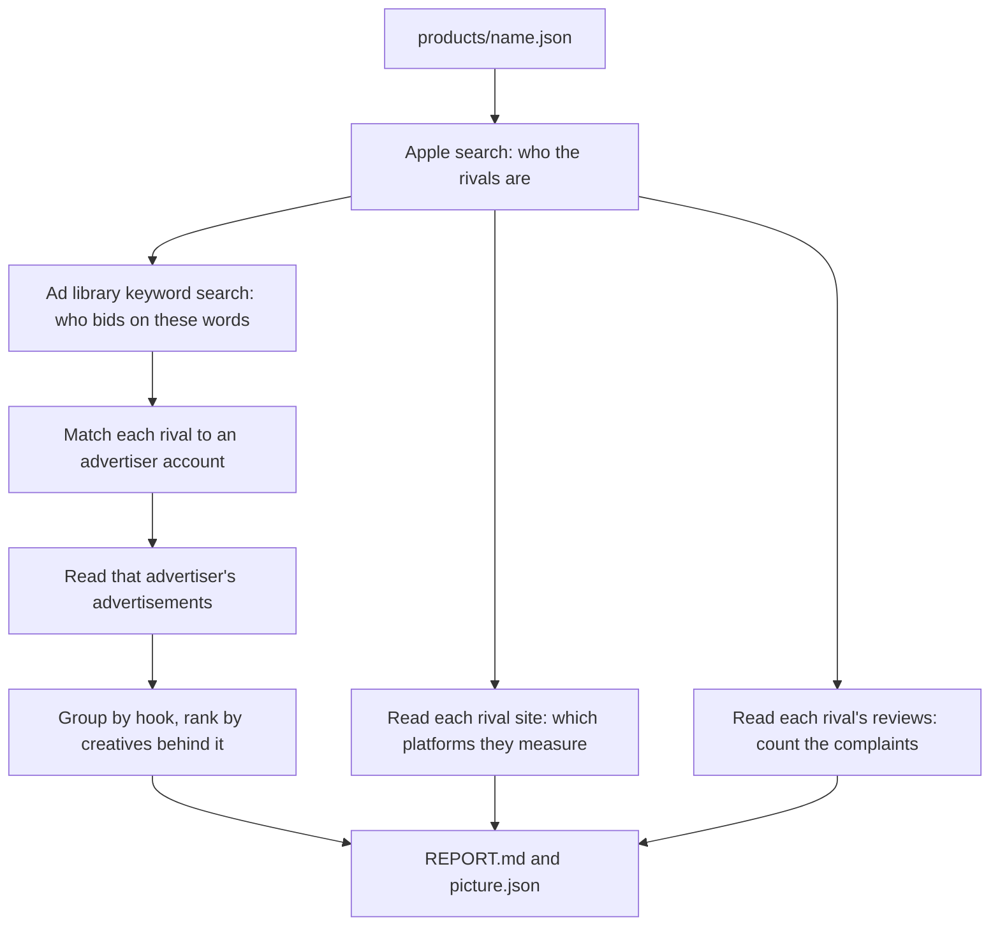

# Proofmark

Put a product in. Get back what the competition does for distribution.

```
node --experimental-strip-types src/run.ts products/hush-log.json
```

It writes `out/<productId>/REPORT.md` and `out/<productId>/picture.json`.

To change the wording of a report without reading any library again:

```
node --experimental-strip-types src/run.ts products/hush-log.json --report-only
```

## What it answers

For one product, in one market:

1. **Who the rivals are.** Found by searching what a buyer would type, not by a list somebody
   wrote by hand.
2. **How the category sells.** Free to install or paid, and what they charge after. This comes
   first in the report because it decides whether any advertisement can work.
3. **Where they buy.** Read from each rival's own site and the public tag container behind it,
   then confirmed against the advertisement library, which is stronger evidence.
4. **What they say, and what they put behind it.** Advertisement copy grouped by hook and ranked
   by how many creatives share it.
5. **Who else bids on those words.** Every advertiser the library reports for the product's own
   search terms, including ones nobody had heard of.
6. **What their customers are angry about.** Complaint themes counted across their low star
   reviews.
7. **What could not be read.** Always printed, never hidden.

## The stages



The order is not a preference. Rivals come from the product's own search terms, advertiser
identities come from the rival names, and the advertisements come from the advertiser identities.
Each stage needs the one above it.

Browser work runs one at a time on purpose. Several driven browsers at once against one host
reads as an attack and gets the address blocked, which costs far more than the time it saves.

## The idea it runs on

An advertisement a company keeps paying for is a conversion signal. A trending video is a
popularity signal. Advertisement transparency is a legal requirement, so the proof of what sells
in a category is public and free.

One correction the first run produced, and it is in the code. **Length of run ranks nothing in a
seasonal category.** SnoreLab's runs last 4 to 15 days. What they repeat is the sentence: 82
creatives behind one hook across seven weeks. So `rankHooks` orders by creatives behind the copy,
then by how many separate runs repeat it. Length of run is reported and does not rank.

## Adding a product

One file in `products/`. Nothing else.

```json
{
  "productId": "hush-log",
  "name": "Hush Log",
  "job": "records and analyses your snoring through the night",
  "appleAppId": "6759836267",
  "market": "gb",
  "storeEntity": "software",
  "searchTerms": ["snoring", "snore", "sleep recorder"],
  "brandTerms": ["hush log", "hushlog"]
}
```

`searchTerms` drives everything downstream, so it is the field worth thinking about.
`brandTerms` stops the product listing itself as its own rival. `storeEntity` is `software` for
iPhone and `macSoftware` for Mac.

## What it costs

Nothing. No key, no account, no paid data provider.

- Apple's search, lookup and review feeds are open.
- The Meta Ad Library answers a headless driven browser with no login, and its own filter
  response returns the advertiser census.
- Tag manager containers are public.

## What it cannot see

Stated in every report, because a silent gap reads like a finding.

- **Apple Search Ads publishes no library.** For an iPhone application that is often the largest
  channel, and nothing here can confirm or deny that a rival uses it.
- **A site pixel says where a company measures web conversions, not where it buys installs.** An
  application install campaign needs no web pixel at all. SnoreLab runs Meta advertisements and
  carries no Meta pixel.
- **No source gives spend.** Everything here measures presence, repetition and complaint volume.
- **Only Meta is wired in.** Google Ads Transparency answers a browser but its search payload
  shape is unsolved. The TikTok Europe library answers and its payload shape is unknown. TikTok
  Creative Center refuses with "no permission".
- **The library does not paginate from a scrolling window**, so a rival with 150 advertisements
  gives up its most recent 17. Reaching the rest needs a different mechanism.
- **Apple withholds the rating count for most Mac applications** while still serving their
  reviews. CleanMyMac reports no rating count and 500 reviews. The report says "ratings not
  published" rather than printing a zero, because a zero would read as "nobody rated it".

## What running it on a second and third product taught us

Four defects, all found by running a product the code was not written for, and all fixed with a
test that fails when the fix is removed.

- The store returns anything that mentions a search term, so the first MacGleam run listed
  **WhatsApp Messenger** as a Mac cleaner rival. A result now has to appear under two or more of
  the product's terms, or reach the top five of one. That cut 40 rivals to 20 and removed the
  noise without losing a real adjacent product.
- **Withheld rating counts were printed as zero**, which reads as a measurement of nothing rather
  than an absence of measurement.
- **A store title is not a brand.** Apple lists "SnoreLab : Record Your Snoring" and the
  advertiser account is called "SnoreLab", so searching the title found nothing and the Hush Log
  run matched zero advertisers. The brand is now taken from the title before searching.
- **An active only search hides a rival between campaigns.** SnoreLab's last United Kingdom run
  ended on 3 February, so an active search says they do not advertise, which is false. The
  fallback search now includes advertisements that have ended.

The pattern is worth naming: every one of these produced a confident, wrong sentence in a report,
and none of them produced an error.

## Not yet built

- Persistence between runs, so an advertisement still running cannot yet accumulate a length of
  run across readings.
- Deduplication across products, so two products sharing a rival read it twice.
- The angle and brief stages, which turn the picture into something to make.
- Results coming back, which is what closes the loop.

## Tests

```
node --experimental-strip-types --test src/*.test.ts
npx tsc --noEmit
```

Every fixture in `meta.test.ts` is copied from a real dump rather than written by hand, so a
change to the library's markup fails a test instead of quietly returning nothing.
